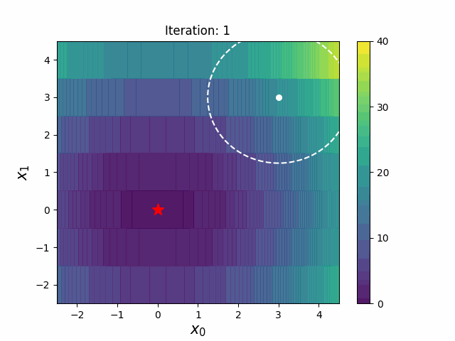
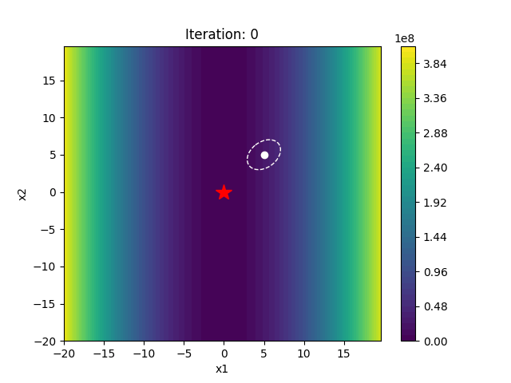
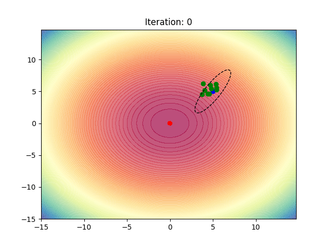

# CMA-ES and its problem

$$ f(x) = x_0^2 + x_1^2 \text{ , where } x_0 \in \mathbb{R}, x_1 \in \mathbb{Z} \text{.} $$

|CMA-ES|CMA-ESwM|
|---|---|
|||

# Comparison
DX-NES-ICI and LMI-NES (proposed).

## ReversedEllipsoidInt
$$g(x)=\sum_{j=1}^{N_\text{int}}(1000^{\frac{j-1}{N-1}}\left[\bar{\textbf{x}}_{\text{int}}\right]_j)^2$$

$$h(x)=\sum_{j=1}^{N_{\text{co}}}(1000^{\frac{N_{\text{int}}+j-1}{N-1}}[\bar{\textbf{x}}_{\text{co}}]_j)^2$$

$$f(x)=g(x)+h(x)$$

|DX-NES-ICI|LMI-NES|
|---|---|
|||

## EllipsoidInt

$$f(x)=\sum_{j=1}^N(1000^{\frac{j-1}{N-1}}\bar{\textbf{x}}_j)^2$$

|DX-NES-ICI|LMI-NES|
|---|---|
|||
